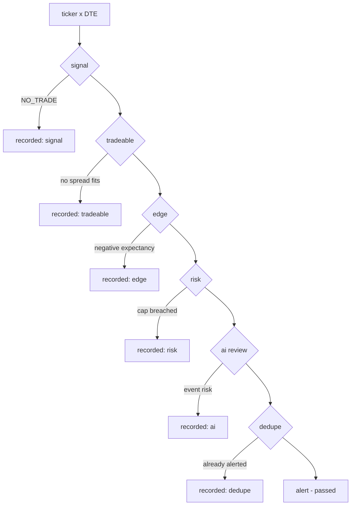
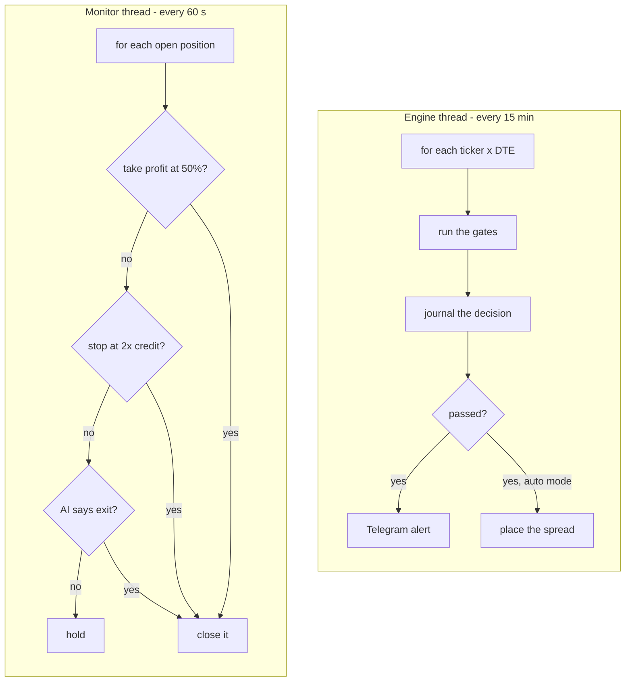
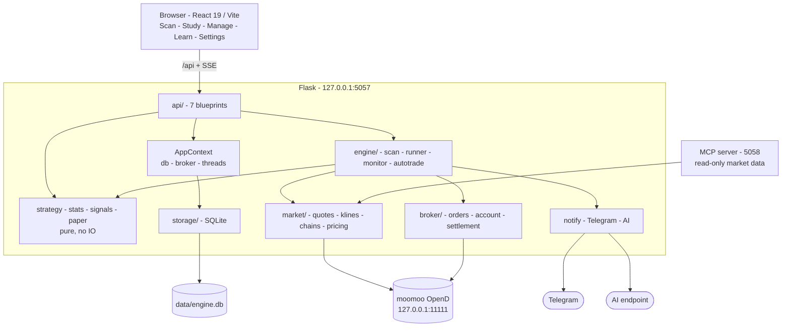

# Theta Desk

**A local trading desk for selling credit spreads on US equity options.**

It scans a watchlist through a fixed set of gates, shows you which gate each
candidate died at and why, and runs the whole thing against a **paper
account** with simulated fills until you tell it otherwise. Switch it to the
live account and the same code places real orders through moomoo OpenD.

<p>
  
  
  
  
  
  
  
</p>

Everything runs on your own machine. There is no hosted component, no account
system and no telemetry. The only things it talks to are your local OpenD
gateway, Telegram (if you configure it) and an AI endpoint (if you configure
one).

> [!WARNING]
> This places **real orders** with **real money** when you switch it to auto
> mode. It is a personal tool, not investment advice and not a product. Read
> [Risk](#risk) before you point it at a funded account.

---

## Contents

- [Why it exists](#why-it-exists)
- [What it does](#what-it-does)
- [Tech stack](#tech-stack)
- [How it works](#how-it-works)
- [Paper and live accounts](#paper-and-live-accounts)
- [System architecture](#system-architecture)
- [Install and set up](#install-and-set-up)
- [Running it](#running-it)
- [Configuration](#configuration)
- [Market data over MCP](#market-data-over-mcp)
- [Project layout](#project-layout)
- [Testing](#testing)
- [Data and files](#data-and-files)
- [Security and your data](#security-and-your-data)
- [Licence](#licence)
- [Risk](#risk)

---

## Why it exists

Credit spreads are easy to find and easy to take for bad reasons: the vol
looked rich, the chart looked oversold, it was Friday. I wanted three things
to keep me honest:

1. **The same rules live and in the backtest.** If the gate that fires today is
   not the gate that was measured over five years, the backtest tells you
   nothing.
2. **A written reason for every decision, including the rejections.** A scan
   that says "no trade" is only useful if it says which gate stopped it.
3. **Position sizing I can't argue with at 3pm.**

The strategy layer is pure Python with no IO, and both the backtest and the
live path call it. Most of the architecture is there to keep it that way.

## What it does

| | |
|---|---|
| **Scan** | Walks your watchlist on a schedule and shows a board of every ticker × DTE with the gate it reached. Failures are as visible as passes. |
| **Study** | One ticker in depth: a live signal streamed step by step, a 3D IV surface, a payoff surface, a backtest over the same gates, and an optional AI second opinion. |
| **Manage** | The active account's book, marked to model on the current spot and remaining time. Not at expiration, so a position with time value has not "won" yet. |
| **Learn** | Where candidates died over the last N days, the pooled edge table by IV-rank bucket, and paper results measured against what the backtest predicted. |
| **Settings** | Watchlist, DTEs, gate switches, risk caps, credentials, and the switch to live trading. |

Alerts go to Telegram. Long jobs (scans, backtests) stream progress over
server-sent events.

## Tech stack

**Backend**

| Choice | Version | Why |
|---|---|---|
| Python | 3.11 | Matches the `futu-api` SDK's supported range |
| Flask | 3.1 | A local single-user dashboard doesn't need an async framework |
| pandas | 3.0 | Kline frames come out of OpenD as DataFrames |
| futu-api | 10.10 | The moomoo OpenD client, for both quotes and orders |
| SQLite | stdlib | One file, transactional, no daemon. No ORM; the schema is small and the queries are hand-written |
| pytest | 9.1 | 570 tests, none of which touch the network |
| mcp | 2.2 | Optional: exposes the market-data tools over MCP |

**Frontend**

| Choice | Version | Why |
|---|---|---|
| React | 19 | |
| TypeScript | 5.9 | The API client is typed end to end |
| Vite | 8 | Dev server with an `/api` proxy; builds to static assets Flask serves |
| Tailwind | 4.3 | Layout and tokens |
| Three.js + React Three Fiber | 0.186 | The IV and payoff surfaces |
| Vitest / Testing Library | 5.0 / 16.3 | 417 tests across 39 files |

No state-management library, no component library, no CSS-in-JS. The logic
lives in plain functions under `src/lib/` and is tested directly.

## How it works

### The gate pipeline

Every candidate is one `(ticker, DTE)` pair run through six gates, **cheapest
first**. The first failure stops the scan and is recorded as the stage it died
at, so nothing silently disappears.



| Gate | Asks |
|---|---|
| `signal` | Does the strategy verdict for the selected modes say anything but NO_TRADE? |
| `tradeable` | Does a spread actually fit (open-interest floor, $500 max risk per trade)? |
| `edge` | Does the pooled 5-year backtest show positive expectancy for this IV-rank bucket, over at least 100 trades? |
| `risk` | Position count, total deployed risk, one position per ticker. |
| `ai` | Optional event-risk review (earnings, news) against an AI endpoint of your choosing. |
| `dedupe` | Have we already alerted this same spread inside the cooldown? |

`edge`, `risk`, `ai` and `dedupe` can each be switched off, except in auto
mode, which always runs `risk` and `ai`.

### The three signal modes

| Mode | Fires on |
|---|---|
| `meanrev` | RSI < 35 or %B < 0.10 **and** stabilising (a green candle). Refuses a falling knife: a new 5-day low with ADX > 25 is no trade. |
| `trend` | EMA20/EMA50 cross with price confirming and ADX > 20. Carries a standing caution: it showed no edge through the 2022 bear market. |
| `ivrich` | IV rank ≥ 2/3 (or IV/RV > 1.2 before 20 days of history exist), then mean reversion on top. The default. |

"IV rank" has one definition, a percentile in `theta/stats.py`, shared by the
live path and the backtest. It is a percentile and not a min-max
normalisation because one historical outlier would otherwise compress every
later reading.

### The edge table

The `edge` gate reads a table of expectancy by (mode, DTE, IV-rank bucket),
rebuilt from a rolling 5-year backtest. It always pools over a fixed
27-ticker validation universe **plus** your watchlist, never the watchlist
alone. A short watchlist leaves cells far under the 100-trade minimum (two
tickers gave `ivrich`/14d/high only 44 trades), and every alert would come back
unvalidated. Pooling lets the gate work from day one.

### The loops



Two background threads, both off by default:

- **The engine** scans on an interval, journals every decision, and alerts on
  passes. `engine_enabled` turns it on. It rebuilds the edge table from a fresh
  backtest whenever it is more than 24 hours old.
- **The monitor** watches open live positions once a minute and is the *only*
  thing allowed to ask the broker to act. Default exits: take profit at 50% of
  the credit, stop out at 2× the credit, or an AI exit review.

Auto mode is a setting the monitor reads, not a separate code path, so manual
and auto cannot drift apart. Switching it on requires typing `LIVE` and passing
a pre-flight check (Telegram configured, AI key present, monitor running, OpenD
connected, trading unlocked).

## Paper and live accounts

The bot trades through one of two accounts, and the same code runs in both.

| | `mode: manual` | `mode: auto` |
|---|---|---|
| **`account_mode: paper`** | notebook only | **the bot runs against simulated fills** |
| **`account_mode: live`** | real account visible, nothing trades | real money |

Paper is the default. Reaching the bottom-right cell takes typing `LIVE` and
passing pre-flight. Starting the paper bot asks for nothing, since there's no
money at stake.

### How paper fills work

The paper account doesn't fill every order. `PaperBroker` implements the
same interface as the real one, and an order fills only when the live market
actually supports its limit price:

- an opening spread fills when the **natural credit** reaches the limit
- a closing one fills when the **natural debit** falls to it

So a mid-priced entry does *not* fill on the spot (the natural credit sits
below mid by half the spread), and the bot's own reprice, timeout and cancel
loop has to get it filled. That loop is the code most likely to be wrong with
real money, and a broker that always filled would never exercise it.

Commissions are charged per leg per contract on both sides
(`paper_fee_per_contract`). Without them a 50% take-profit on a $0.30 credit
looks much better on paper than it would live.

### The two books never mix

Every position and bot trade belongs to an account, and the queries that could
otherwise total simulated and real money together take the account as a
**required** argument. Forgetting it raises a `TypeError` instead of returning
a wrong number. Buying power, P&L, the scan board's risk check and the exposure
matrix all read only the active account.

### Leaving the live account

Switching from live to paper **is refused while any live trade is open or
working**, and the error names the tickers in the way:

```
Close the live account's open positions first (NVDA).
Switching to paper would leave them unmanaged.
```

The monitor is the only thing that closes a position and it follows the account,
so allowing the switch would leave a funded spread with nothing watching it.

The status line on every screen shows which account is trading. Live is shown
as a warning: nothing is wrong, but it's the state where a mistake costs money.

## System architecture



### Layout rules

**Dependencies point downward only.** `strategy` and `stats` are pure and
import nothing of ours. `market/` and `storage/` know nothing about `engine/`.
Nothing below `api/` knows that Flask exists, which is why the engine can run
headless and the tests never need a request context.

**Every side effect is injected.** The scan pipeline and the monitor take their
IO as a dict of callables, so the entire decision path runs offline against
fakes. That's why 570 backend tests finish in under four seconds and none of
them can accidentally reach OpenD or fire a real order.

**Process state is passed in, not reached for.** The database path, broker
client and the two threads live in an `AppContext` built once and handed to
`create_app()`:

```python
app = create_app(AppContext(db_path=tmp / "app.db", broker=FakeBroker()))
```

Tests construct a context instead of reassigning module globals, so they can
run several independent apps at once.

| Module | Responsibility |
|---|---|
| `config` · `paths` | `.env` loading; where the database and caches live |
| `stats` · `strategy` | Percentile rank; indicators, gate verdicts, spread construction. **Pure** |
| `signals` | A live signal: market data through the gates |
| `paper` | Marking a book to model |
| `credentials` · `context` | Which setting maps to which env var; per-process state |
| `services` | Wires the engine and monitor to the outside world |
| `notify` | Telegram alerts, AI trade review |
| `mcp_server` | Read-only market data over MCP |
| `market/` | Quotes, klines, option chains, IV, pricing, rate limiting |
| `storage/` | SQLite: positions, paper trades, settings, journal, edge table |
| `broker/` | Orders, account, position management, settlement |
| `engine/` | Gate pipeline, scan loop, position monitor, auto-trade |
| `research/` | Backtest and aggregate statistics |
| `api/` | Flask blueprints (7) + the SSE generators |

### A note on rate limiting

OpenD rejects bursts, and it rejects them per account, not per process. Every
call goes through a shared limiter keyed by method (`get_option_chain` is
capped at 9 per 30s; the quote endpoints at 55). A "high frequency" error waits
one full window and retries. The MCP server routes through the same limiters
instead of opening its own connection, so it shares the quota with the engine
and the two don't throttle each other.

## Install and set up

### Requirements

- **Python 3.11**
- **Node 20+**
- **[moomoo OpenD](https://www.moomoo.com/download/OpenAPI)**, running and
  logged in, with US options market data. Without it the UI, the paper book and
  the backtest still work; anything needing live quotes returns a clear error.

### Install

```bash
git clone https://github.com/<your-username>/theta-desk.git
cd theta-desk
./setup.sh
```

`setup.sh` checks your toolchain, creates `backend/.venv`, installs the backend
(app, tests and the MCP server) and the frontend, seeds `.env` from
`.env.example`, then verifies the install. It is safe to re-run; it only does
what is missing.

```bash
./setup.sh --force               # rebuild .venv and node_modules from scratch
PYTHON=/path/to/python3.11 ./setup.sh
```

### Then

```bash
./run.sh
```

First run takes a minute: it runs both test suites, builds the UI, then opens
<http://127.0.0.1:5057>.

## Running it

```bash
./run.sh                 test -> build -> serve desk (5057) + MCP (5058)
./run.sh --dev           also run Vite on 5173 with hot reload
./run.sh --skip-tests    skip the test gate
./run.sh --no-mcp        desk only
./run.sh --no-open       do not open a browser
./run.sh --help
```

| Variable | Default | |
|---|---|---|
| `PORT` | `5057` | The desk |
| `MCP_PORT` | `5058` | The MCP server |
| `VITE_PORT` | `5173` | Vite, with `--dev` |
| `OPEND_HOST` / `OPEND_PORT` | `127.0.0.1:11111` | The OpenD gateway |

Ctrl-C stops everything it started. It checks its ports up front and exits
with a clear message if one is taken.

**For development**, use `./run.sh --dev`: the API on 5057 and Vite on 5173
with hot reload, proxying `/api` across. Open 5173, not 5057.

## Configuration

Three layers, and the more specific one wins:

```
Settings screen  >  .env  >  your shell environment
```

Credentials saved in Settings are laid *over* the environment instead of
replacing it, so leaving a field blank keeps `.env` in charge and a headless run
is unaffected. Saved secrets are never sent back to the browser (see
[Secrets](#secrets)).

| Variable | For |
|---|---|
| `TELEGRAM_BOT_TOKEN`, `TELEGRAM_CHAT_ID` | Alerts |
| `AI_API_KEY`, `AI_API_ENDPOINT`, `AI_MODEL` | AI trade review. All three, or the review stays off |
| `OPEND_HOST`, `OPEND_PORT` | OpenD gateway |
| `PORT`, `MCP_PORT` | Server ports |
| `CS_DB_PATH` | Database file (default `data/engine.db`) |

No AI endpoint or model is built in. The review is a paid call to someone
else's service, so you have to pick one: until all three values are set the
review does not run, and with `ai_enabled` on it reports itself as
unavailable. The Settings screen lists some providers that speak the Anthropic
API, along with the auth header each expects. None is preselected, and the
endpoint field takes any compatible URL, listed or not.

Everything else (watchlist, DTEs, interval, gate switches, risk caps, exit
rules) lives in the Settings screen and is validated server-side before it is
stored.

Defaults worth knowing: **paper account**, engine **off**, bot **stopped**,
`ivrich` only, DTEs 7 and 14, scan every 15 minutes during market hours, max 5
open positions, max $2,500 deployed, $500 risk per trade, take profit 50%, stop
at 2× credit, $10,000 simulated cash and $0.65 per contract in paper
commissions.

## Market data over MCP

The same OpenD quote path is exposed as an MCP server with three tools:
`quote`, `option_expirations` and `option_chain`, with live bid/ask, IV, delta,
theta and open interest. It is **read-only**: it places no orders and writes
nothing. `setup.sh` installs it.

`run.sh` serves it over HTTP:

```json
{ "moomoo": { "type": "http", "url": "http://127.0.0.1:5058/mcp" } }
```

Clients that prefer to launch the server themselves can use stdio, which needs
nothing already running:

```json
{
  "moomoo": {
    "type": "stdio",
    "command": "/absolute/path/to/theta-desk/backend/.venv/bin/python",
    "args": ["-m", "theta.mcp_server"]
  }
}
```

## Project layout

```
theta-desk/
├── setup.sh              one-time install
├── run.sh                start everything
├── backend/
│   ├── pyproject.toml
│   ├── theta/
│   │   ├── __main__.py       python -m theta
│   │   ├── strategy.py       indicators, verdicts, spread builder  (pure)
│   │   ├── stats.py          percentile rank                       (pure)
│   │   ├── signals.py        a live signal
│   │   ├── paper.py          marking a book to model
│   │   ├── context.py        AppContext
│   │   ├── services.py       dependency wiring
│   │   ├── notify.py         Telegram + AI review
│   │   ├── mcp_server.py     read-only MCP tools
│   │   ├── api/              7 blueprints + SSE streams
│   │   ├── market/           OpenD data, pricing, rate limiting
│   │   ├── storage/          SQLite
│   │   ├── broker/           orders, account, settlement, and the paper broker
│   │   ├── engine/           gates, scan loop, monitor, autotrade
│   │   └── research/         backtest
│   └── tests/                mirrors the package
├── frontend/
│   └── src/
│       ├── lib/              typed API client + all view logic (tested directly)
│       ├── components/
│       └── screens/          Scan, Study, Manage, Learn, Settings
└── docs/
    ├── architecture.md
    ├── paper-and-live-accounts.md
    └── credit_spread_spec.md
```

## Testing

```bash
cd backend  && .venv/bin/python -m pytest      # 570 tests
cd frontend && npm test                        # 417 tests, 39 files
```

Both run automatically in `run.sh` before the server starts.

No test reaches the network. Market data is faked at the module boundary and
the broker has a fake that records orders instead of sending them, so the
order path is covered without anything leaving the machine. A contract test
compares `PaperBroker` against the real `Broker` method for method; if the two
drift, paper results stop saying anything about live.

## Data and files

| Path | What | Tracked? |
|---|---|---|
| `data/engine.db` | Positions, paper trades, settings, journal, edge table | No |
| `klines_cache/` | Daily bars per ticker | No |
| `iv_history/` | ATM IV per ticker per day | No |
| `.env` | Your credentials | **No** |
| `frontend/dist/` | The UI build | No |

Everything generated is rebuildable and git-ignored. Delete any of it and it
comes back; the one thing worth backing up is `data/engine.db`.

## Security and your data

### Localhost only

The server binds to `127.0.0.1`, which keeps other machines out. That alone is
not enough. A web page you visit can point its own domain at `127.0.0.1` (DNS
rebinding), and then the browser treats it as same-origin with the desk. It
could read your book and post to every endpoint, and there is no login to stop
it, because a single-user local tool has none.

So every request's `Host` header is checked, and anything that did not address
the desk as `localhost` is refused with a 403 before it reaches a handler. The
MCP server has the same protection. Set `THETA_ALLOWED_HOSTS` (comma-separated)
if you front the desk with a hostname of your own; it is additive, so loopback
keeps working.

Request bodies are parsed only when they are declared as JSON, so a cross-origin
form post sent as `text/plain` cannot reach a handler.

### Secrets

`.env` and `data/engine.db` are both created `0600`, and `data/` `0700`. The
database stores your AI key and Telegram token in clear text, and a mode on the
file alone still lets anyone list what sits beside it. A database restored from
a backup is locked down again on the next connection.

A saved secret is never sent back to the browser: it reads out as a fixed-width
mask, and posting that mask back means "unchanged". No key appears in any error
response, log line or journal entry.

### What leaves your machine

Nothing is sent anywhere unless you configure it. There is no telemetry, no
analytics and no crash reporting. Apart from your local OpenD gateway, the AI
provider and Telegram are the only outbound calls in the codebase.

| Destination | What it receives |
|---|---|
| **Your AI provider** | Ticker, spot, IV and rank, indicators, the mode verdicts and the proposed spread. Exit reviews also send the open position and what it costs to close. |
| **Telegram** | The alert text: ticker, strikes, credit. |
| **OpenD** | Your orders and quote requests, to a gateway on your own machine. |

This means the AI review sends your strategy and your open positions to a third
party. The feature can't work without that, but it is the one place your data
goes: no endpoint is configured by default, and `ai_enabled: false` turns it
off entirely.

### What this does not protect against

Anything already running as your user. A local process can read `data/engine.db`
the same way the desk does, and the desk trusts every request that reaches it
from localhost. The threat model is a hostile web page, not a hostile machine.

## Licence

MIT, see [LICENSE](LICENSE). Use it, fork it, change it; keep the copyright
notice. It comes with no warranty of any kind, which matters more than usual
for a tool that trades (see [Risk](#risk)).

## Risk

This is a personal tool published as-is. It is **not investment advice**, not a
product, and carries no warranty.

Each credit spread has a defined maximum loss, but nothing limits how many
times in a row you can hit it. The backtest in here is a backtest. It is not
evidence about tomorrow, and the `trend` mode carries a standing caution because
five years of data said it stopped working in a bear market.

Before you switch to the live account:

- Run it in paper mode for a good while and check its decisions against your
  own.
- Read `docs/credit_spread_spec.md` and run the backtest yourself.
- Understand that the monitor closes positions on rules you set, and that a gap
  through your short strike does not wait for a 60-second loop.

The live safeguards (typing `LIVE`, the pre-flight check, and refusing to leave
the live account with positions open) are described in
[Paper and live accounts](#paper-and-live-accounts).
